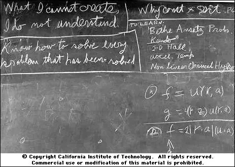
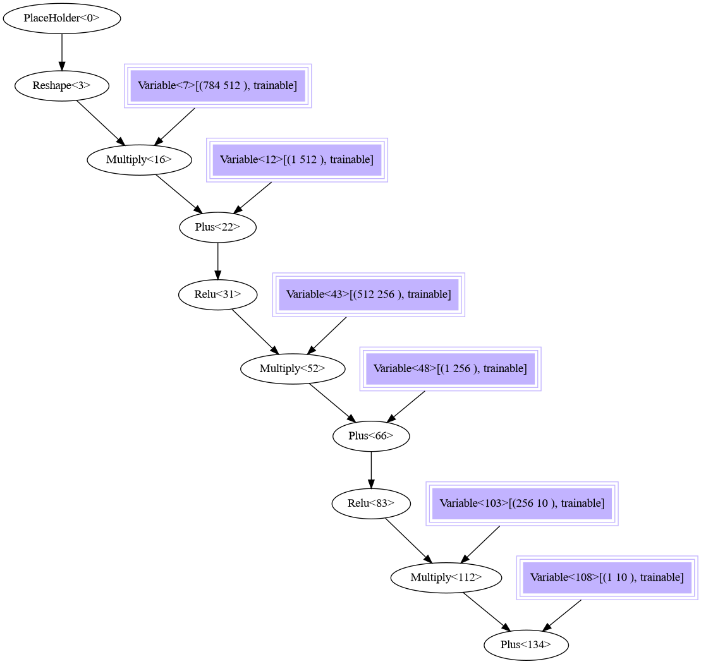
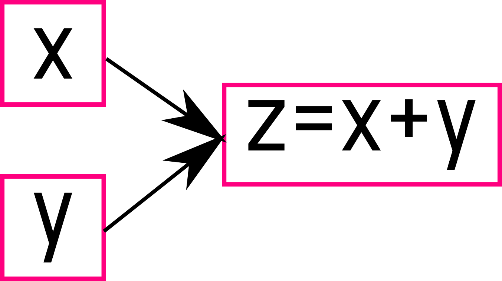
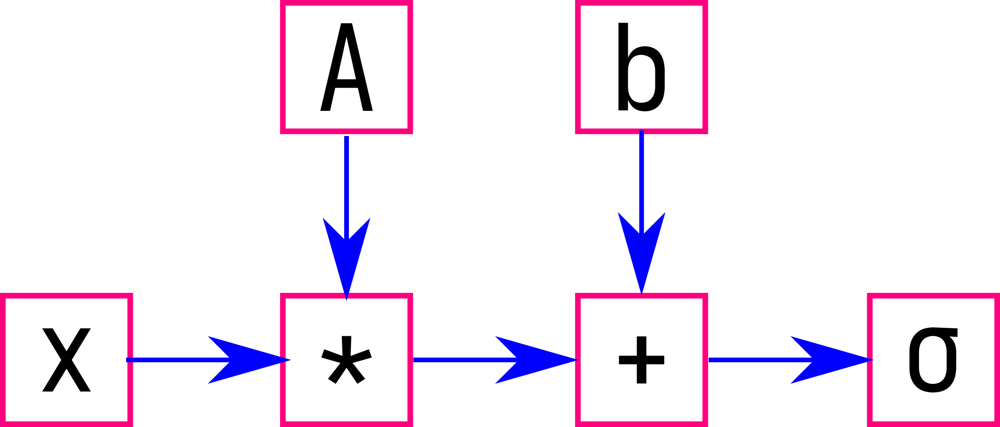

# Ceras

----



What I cannot create, I do not understand. -- Richard Feynman


__ceras__ is yet another deep learning engine aiming to reinvent Keras, in C++20 and header-only.

----

## Table of contents

* [Getting started](#getting-started)
* [Features](#features)
* [Usage](#usage)
* [Design](#design)
* [Examples](#examples)
* [Supported layers/operations](#supported-layers)
* [TODO](#todo)
* [License](#license)
* [Acknowledgments](#acknowledgements)


----

## Getting Started

A `model` is a way to organize layers. Here is an example to build a sequential model.

First, we include the header and use the namespace of this library:

```cpp
#include "./include/ceras.hpp"
using namespace ceras;
```

Then we compose layers using a functional interface to build up a computation graph:

```cpp
auto input = Input(); // shape( 28, 28 )
auto l0 = Reshape({28*28,})( input );
auto l1 = ReLU( Dense( 512, 28*28 )( l0 ) );
auto l2 = ReLU( Dense( 256, 512 )( l1 ) );
auto output = Dense( 10, 256 )( l2 );
```

We build up a model by collecting the input layer and the output layer of the computation graph:

```cpp
auto m = model{ input, output };
```

We can dump the structure of this computation graph to double check the architecture:

```cpp
m.summary( "./mnist_minimal.dot" );
```

After generating a dot file [`'mnist_minimal.dot'`](./assets/mnist_minimal.dot),
we convert it to a '.png' file by executing command `dot -Tpng ./mnist_minimal.dot -o ./mnist_minimal.png`, where `dot` is an external command from package [ImageMagick](https://www.imagemagick.org/).




Before feeding a training set to this model, we configure the training hyper-parameters

```cpp
unsigned long batch_size = 10;
float learning_rate = 0.01;
auto cm = m.compile( CategoricalCrossentropy(), SGD(batch_size, learning_rate) );
```

Then we can train this model. Typical training API is:

```cpp
unsigned long epoch = 50;
int verbose = 1;
double validation_split = 0.1;
cm.fit( input_data_of_784, output_data_of_10, batch_size, epoch, verbose, validation_split );
```

We can also train this model batch by batch:

```cpp
cm.train_on_batch( input_batch_of_784, output_batch_of_10 );
```

We can evaluate the performance this way:

```cpp
auto error = cm.evaluate( test_data_of_784, test_data_of_10, batch_size );
```

We can also calssify new samples:

```cpp
auto prediction = cm.predict( new_data_of_784 );
```

Check out a minimal example from [here](./test/mnist_minimal.cc). On Linux/Unix, type `make mnist_minimal && ./bin/test_mnist_minimal`  or `make mnist_conv2d_minimal && ./bin/test_mnist_conv2d_minimal` to try.

#### Some more examples:

- vgg16: [model](./examples/vgg16/vgg16.cc) and [visualization](./examples/vgg16/vgg16.png).
- unet: [model](./examples/unet/unet.cc) and [visualization](./examples/unet/unet.png).

### Implementation using mid-level APIs


First we define the input layer:

```cpp
// define computation graph, a 3-layered dense net with topology 784x256x128x10
using namespace ceras;
auto input = place_holder<tensor<float>>{}; // 1-D, 28x28 pixels
```

Then we define the first layer with relu activation

```cpp
// 1st layer
auto w1 = variable{ randn<float>( {28*28, 256}, 0.0, 10.0/(28.0*16.0) ) };
auto b1 = variable{ zeros<float>( { 1, 256 } ) };
auto l1 = relu( input * w1 + b1 );
```

The second layer with relu/sigmoid activation

```cpp
// 2nd layer
auto w2 = variable{ randn<float>( {256, 128}, 0.0, 3.14/(16.0*11.2 )) };
auto b2 = variable{ zeros<float>( { 1, 128 } ) };
//auto l2 = relu( l1 * w2 + b2 );
auto l2 = sigmoid( l1 * w2 + b2 );
```

And the last layer

```cpp
// 3rd layer
auto w3 = variable{ randn<float>( {128, 10}, 0.0, 1.0/35.8 ) };
auto b3 = variable{ zeros<float>( { 1, 10 } ) };
auto output = l2 * w3 + b3;
```

After defining the model, we can define the loss

```cpp
auto ground_truth = place_holder<tensor<float>>{}; // 1-D, 10
auto loss = cross_entropy_loss( ground_truth, output );
```

And create a session

```cpp
// creating session
session<tensor<float>> s;

tensor<float> input_images = ...; // (batch_size, 784)
tensor<float> output_labels = ...; // (batch_size, 10)
s.bind( input, input_images );
s.bind( ground_truth, output_labels );
```

Defining an optimizer

```cpp
float learning_rate = 1.0e-1f;
auto optimizer = gradient_descent{ loss, batch_size, learning_rate };
```

And starting training the loss and the optimizer

```cpp
for ( auto e : range( epoch ) )
{
    for ( auto i : range( iteration_per_epoch ) )
    {
        // here we update the contents in input_images and output_labels
        s.run( loss ); //forward pass
        s.run( optimizer ); //backward pass
    }
}
```

At last we can make prediction, this is done by rebinding the input layer

```cpp
std::size_t new_batch_size = 1;
tensor<float> new_input_images{ {new_batch_size, 28 * 28} };
s.bind( input, new_input_images );

auto precition = s.run( output );
```

Checkout full example from this [file](./test/mnist.cc).


## Features
- Fast and GPU memory friendly:
    - 98% accuracy on MNIST in 10 epochs in 30s (loading dataset, training and validation on a laptop with Intel(R) Core(TM) i7-7700HQ and a mobile GTX 1060);
    - only time-consuming operations are accelerated by GPU (such as GEMM), and your GPU memory size is not the restriction for large batch size.
- Portable:
    - header-only;
    - CUDA acceleration is optional, not a must.
- Simply implemented:
    - mimicking Tensorflow/keras grammar for ease of use;
    - minimizing the levels of indirections to expose as many implementation details as possible.

## Usage
__Using this library__:

copy the `include` directory to the working directory, then include the header file

```cpp
#include "ceras.hpp"
```

**Compile/link**:

```bash
g++ -c -std=c++20 -Wall -Wextra -ferror-limit=1 -ftemplate-backtrace-limit=0 -funsafe-math-optimizations  -Ofast -flto -pipe -march=native -DNDEBUG -o ./obj/test_mnist.o test/mnist.cc
g++ -o ./bin/test_mnist ./obj/test_mnist.o -funsafe-math-optimizations  -Ofast -flto -pipe -march=native
```

[CBLAS](https://www.netlib.org/lapack) can be optionally enabled by define macro `CBLAS` (tested with cblas 3.10.0, g++ 11.1.0):

```bash
g++ -c -std=c++20 -ftemplate-backtrace-limit=0 -funsafe-math-optimizations  -Ofast -flto -pipe -march=native -DCBLAS -o ./obj/test_mnist.o test/mnist.cc
g++ -funsafe-math-optimizations  -Ofast -flto -pipe -march=native -o ./bin/test_mnist ./obj/test_mnist.o -L/opt/cuda/lib64 -pthread  -lcblas
```


[CUDA/CUBLAS](https://developer.nvidia.com/cuda-zone) could be optionally enabled by defining macro `CUDA`: (tested with cuda 11.2.r11.2, gcc 11.1.0, note the compile/link options)

```bash
g++ -c -std=c++20 -Wall -Wextra -fmax-errors=1 -ftemplate-backtrace-limit=0 -funsafe-math-optimizations  -Ofast -flto -pipe -march=native -DCUDA -DNDEBUG -o ./obj/test_mnist.o test/mnist.cc
g++ -funsafe-math-optimizations  -Ofast -flto -pipe -march=native -o ./bin/test_mnist ./obj/test_mnist.o -L/opt/cuda/lib64 -pthread  -lcudart -lcublas
```
However, this will override CBLAS.


Note: As [Non-Type Template Parameters](http://www.open-std.org/jtc1/sc22/wg21/docs/papers/2018/p0732r2.pdf) is not yet implemented in clang, only gcc works with this library.

## Design


### [tensor](./include/tensor.hpp)
A `tensor` variable holds a multiple dimensional array.  It can be created directly by its constructor:
```cpp
ceras::tensor<float> a{{2, 1, 2}, {0.0f, 0.1f, 0.2f, 0.3f}};
```
in which the template parameter `float` is for the data type, the first argument `{2, 1, 2}` is for the tensor shape, and the second argument `{0.0f, 0.1f, 0.2f, 0.3f}` is for the data stored in the tensor.

Quite a few operations, such as `+`, `-`, `*`,  `abs`,  `random`, `randn`, `reduce` and `max` are implemented for `tensor`. But these operations are there to serve the purpose of deep learning, not intend to make a generic tensor library.


#### creating tensors

An empty tensor could be directly created using its constructor by passing a shape parameter:

```cpp
auto data = ceras::tensor<float>{{16, 28, 28, 77}};
```

Or creating a zeros tensor:

```cpp
auto empty = ceras::zeros<float>( {16, 28, 28, 21} );
auto empty_2 = ceras::zeros_like( data );
```

or creating a ones tensor:

```cpp
auto one = ceras::ones<float>( { 28, 28, 21} );
auto one_2 = ceras::ones_like( data );
```

or a tensor filled with random values

```cpp
auto r = ceras::random<float>( {12, 34} ); // U(0, 1)
auto r_1 = ceras::random<float>( {12, 34}, -10.0, 10.0 ); // U(-10, 10)
auto r_2 = ceras::random_like( data ); // U(0, 1)
auto r_3 = ceras::random_like( data, -10.0, 10.0 ); // U(-10, 10)
```

or a tensor sampling values from a Normal distribution
```cpp
auto n = ceras::randn<float>( {12, 34} ); // N(0, 1)
auto n_1 = ceras::randn<float>( {12, 34}, 1.0, 10.0 ); // N(1, 10)
auto n_2 = ceras_randn_like( data ); // N(0, 1)
auto n_3 = ceras_randn_like( data, 1.0, 10.0 ); // N(1, 10)
```

#### access elements

It is possible to access elements by iterators to read
```cpp
std::copy( data.begin(), data.end(), std::ostream_iterator<float>( std::cout, " " ) );
```
or write a tensor
```cpp
std::fill( data.begin(), data.end(), 0.0 );
```

1D view is enabled by default:
```cpp
data[0] = 1.0;
data[100] = -1.0;
```

2D view is possible by exposing the tensor data and by setting up two dimensional parameters:
```cpp
auto v2 = ceras::view_2d{ data.data(), 16, 28*28*77 };
v2[11][28] = 0.0;
```

For 3D view, three parameters are required
```cpp
auto v3 = ceras::view_3d{ data.data(), 16, 28, 28*77 };
v3[11][20][40] = 0.0;
```

For 4D view, four parameters are required
```cpp
auto v4 = ceras::view_3d{ data.data(), 16, 28, 28, 77 };
v4[11][20][10][20] = 0.0;
```


### [constant](./include/constant.hpp)
A `constant` variable  holds a `tensor` instance, and this `tensor` is not supposed to be updated in its life-time.

```cpp
ceras::tensor<float> eye{{2, 2}, {1.0f, 0.0f, 0.0f, 1.0f}};
ceras::constant<ceras::tensor<float>> c_eye{eye};
```

### [place_holder](./include/place_holder.hpp)
A `place_holder` variable holds a position that a `tensor` will be fed later.

```cpp
ceras::place_holder<ceras::tensor<float>> input{};
// ......
auto&s = ceras::get_default_session<ceras::tensor<float>>();
ceras::tensor<float> a{{2, 1, 2}, {0.0f, 0.1f, 0.2f, 0.3f}};
s.bind(input, a ); // binding a tensor to a place_holder
```

### [variable](./include/variable.hpp)

A `variable` variable  holds a stateful `tensor`, and this `tensor` will be updated anytime. This is designed for the weights in a neural network, which will be updated in every epoch of the training.

```cpp
auto w = ceras::variable{ ceras::randn<float>( {28*28, 256}, 0.0, 10.0/(28.0*16.0) ) };
```

We can also apply regularizers to this variable:
```cpp
float const l1_regularizer = 1.0e-5;
float const l2_regularizer = 1.0e-5;
auto w = ceras::variable{ ceras::randn<float>( {28*28, 256}, 0.0, 10.0/(28.0*16.0) ), l1_regularizer, l2_regularizer };
```


### [value](./include/value.hpp)

A `value` variable holds a constant value. The operations between a value and another operator (such as a constant, a place holder, a variable or an operation) is element-wised.
```cpp
auto v = ceras::value{ 0.0f };
auto op = ...; // a constant, a place holder, a variable, or an operation
auto xx = ceras::maximum( v op );
//auto xx = v + op;
//auto xx = v - op;
//auto xx = v * op;
```

### [operation](./include/operation.hpp) and  computation graph
__ceras__ uses [expression template](https://en.wikipedia.org/wiki/Expression_templates) to represent a computation graph. A computation graph is a directed graph in which each node corresponds to a `variable`, a `place_holder`, a `constant` or an `operation`.  In __ceras__, these node types are grouped in a `Expression` concept.

For example, a computation graph computes output _Expression_ `z` of two input _Expression_ `x` and `y`. Here `x` and `y` are two input nodes of `z`, and `z` is the consumer of `x` and `y`.



If `x` and `y` are two tensors are to be binded in a later stage, the corresponding code is
```cpp
auto x = ceras::place_holder<ceras::tensor<float>>{};
auto y = ceras::place_holder<ceras::tensor<float>>{};
auto z = x + y;
```

This kind of expression is more useful when the computation is getting more complex, for example `z = σ(A*x+b)`



in which `x`, `A` and `b` are `variable`s / `place_holder`s / `constant`s, and `*`, `+` and `σ` are `operations`s.

If `A` and `b` are two variables, and `x` is a place_holder, then the corresponding code is
```cpp
auto x = ceras::place_holder<ceras::tensor<float>>{};
auto A = ceras::variable{ ceras::ones<float>({3, 3}) };//just for demostration, should not be initialized to ones
auto b = ceras::variable{ ceras::zeros<float>({3,}) };
auto z = sigmoid( A*x + b );
```

### [session](./include/session.hpp)

To evaluate the operations (computation graph), we need a session.

```cpp
auto&s = ceras::get_default_session<ceras::tensor<float>>();
```


Then we can bind a tensor to `x`,
```cpp
auto X = ceras::tensor<float>{{3,}, {1.0f, 2.0f, 3.0f}};
s.bind(x, X);
```

And evaluate the output at node `z`:
```cpp
auto result = s.run(z);
```

This will generate a result tensor with shape `(3,)` and values `(0.997527, 0.997527,0.997527)`. In addition, the `x`,  `A` and `b` can also be evaluated by calling
```cpp
auto _x = s.run(x);
auto _A = s.run(A);
auto _b = s.run(b);
```

By design, an instance of an expression has a built-in `forward()` method. When a session runs an expression, the `forward()` method will be invoked.

Please find the complete code from [this file](./test/session.cc).


A `session` can be serialized to a file
```cpp
s.save( "./test/mnist.session" );
// or
s.serialize( "./test/mnist.session" );
```

Also it can be deserialized from a file
```cpp
s.restore( "./test/mnist.session" );
// or
s.deserialized( "./test/mnist.session" );
```

### [loss](./include/loss.hpp)

A `loss` variable provides a metric between the expected output and the actual output of the computation graph. And a `loss` is implemented as an `Expression`. For example, the `mae` loss can be defined as

```cpp
template < Expression Lhs_Expression, Expression Rhs_Expression >
auto constexpr mae( Lhs_Expression const& ground_truth, Rhs_Expression const& output ) noexcept
{
    return mean_reduce(abs(ground_truth - output));
};
```
in which `mean_reduce`, `abs` and `-` are predefined operations. Usually the `ground_truth` is just a place_holder variable, and will be rebinded at every training epoch.

We can define our loss operation with a place_holder for the ground_truth

```cpp
auto ground_truth = ceras::place_holder<tensor<float>>{};
auto loss = mae(ground_truth, z);
```

### [optimizer](./include/optimizer.hpp)

An `optimizer` variable holds an instance of an `expression` of loss. When an session runs an optimizer, the builtin method `forward()` will be invoked. And we define an optimizer this way:

```cpp
unsigned long batch_size = ...;
float learning_rate = ...;
auto optimizer = ceras::sgd{loss, batch_size, learning_rate};
```

In a single epoch, we first execute a forward pass on the loss, with input `x` and `ground_truth` having been binded:
```cpp
s.bind( x, ...);
s.bind(ground_truth, ...);
s.run(loss);
```

then we execute a backward pass with the optimizer:
```cpp
s.run(optimizer);
```

By repeating forward pass and backward pass multiple times, the weights A and the bias b can be gradually updated.


### [model](./include/model.hpp)

`model` groups an expression template into an object with training and inference features.

We can first define an expression template
```cpp
auto input = Input();
auto l1 = relu( Dense( 512, 28*28 )( input ) );
auto l2 = relu( Dense( 256, 512 )( l1 ) );
auto output = sigmoid( Dense( 10, 256 )( l2 ) );
```

Then we train this little model by defining a loss and an optimizer
```cpp
// training
```

Afterwards, we can build a model for later use,

```cpp
auto m = model{ input, output };
```

Then we can make some predictions using this model
```cpp
auto prediction = m.predict( some_input_dataset );
```


### more details

__TODO__

## Examples


### implement VGG16

There are a few pre-defined layers in file `./include/layer.hpp`, such as `Input`, `Conv2D` and `Dense`. Starting from these layers, we are already able to build a VGG16 model.


The input layer for VGG16 is defined as
```cpp
auto input = Input(); //  3D tensor input, (batch_size, 224, 224, 3)
```
followed by a convolutional layer and a relu activation
```cpp
auto l0 = relu( Conv2D( 64, {3, 3}, {224, 3, 3}, "same" )(input) ); // 224, 224, 64
```
and a max pooling layer
```cpp
auto l1 = max_pooling_2d( 2 ) ( l0 ); // 112, 112, 64
```
Then 2 convolutional layers and a max pooling layer
```cpp
auto l2 = relu( Conv2D( 128, {3, 3}, {112, 112, 64}, "same" )( l1 ) ); // 112, 112, 128
auto l3 = relu( Conv2D( 128, {3, 3}, {112, 112, 128}, "same" )( l2 ) ); // 112, 112, 128
auto l4 = max_pooling_2d( 2 ) ( l3 ); // 56, 56, 128
```
followed by 3 convolutional layers and a max pooling layer
```cpp
auto l5 = relu( Conv2D( 256, {3, 3}, {56, 56, 128}, "same" )( l4 ) ); // 56, 56, 256
auto l6 = relu( Conv2D( 256, {3, 3}, {56, 56, 256}, "same" )( l5 ) ); // 56, 56, 256
auto l7 = relu( Conv2D( 256, {3, 3}, {56, 56, 256}, "same" )( l6 ) ); // 56, 56, 256
auto l8 = max_pooling_2d( 2 ) ( l7 ); // 28, 28, 256
```
followed by another 3 convolutional layers and a max pooling layer
```cpp
auto l9 = relu( Conv2D( 512, {3, 3}, {28, 28, 256}, "same" )( l8 ) ); // 28, 28, 512
auto l10 = relu( Conv2D( 512, {3, 3}, {28, 28, 512}, "same" )( l9 ) ); // 28, 28, 512
auto l11 = relu( Conv2D( 512, {3, 3}, {28, 28, 512}, "same" )( l10 ) ); // 28, 28, 512
auto l12 = max_pooling_2d( 2 ) ( l11 ); // 14, 14, 512
```
and again
```cpp
auto l13 = relu( Conv2D( 512, {3, 3}, {14, 14, 512}, "same" )( l12 ) ); // 14, 14, 512
auto l14 = relu( Conv2D( 512, {3, 3}, {14, 14, 512}, "same" )( l13 ) ); // 14, 14, 512
auto l15 = relu( Conv2D( 512, {3, 3}, {14, 14, 512}, "same" )( l14 ) ); // 14, 14, 512
auto l16 = max_pooling_2d( 2 ) ( l15 ); // 7, 7, 512
```
then this 3d layer is flattened to 1d
```cpp
auto l17 = flatten( l16 ); // 7x7x512
```
followed by a dense layer
```cpp
auto l18 = relu( Dense( 4096, 7*7*512 )( l17 ) ); // 4096
```
and then 2 dense layers to the output layer
```cpp
auto l19 = relu( Dense( 4096, 4096 )( l18 ) ); // 4096
auto l20 = relu( Dense( 1000, 4096 )( l19 ) ); // 1000
auto output = l20;
```

With above codes, VGG16 model has been build. However, we not train this model here as we do not have the training set yet. But we can demonstrate the training process with mnist, which is a dataset much smaller than imagenet.
The computation graph can be found from [this file](./examples/vgg16/vgg16.dot) and [this image](./examples/vgg16/vgg16.png).


### [defining a 3-layered NN, 256+128 hidden units](./test/mnist_mini.cc) for mnist

**define a 3 layer model**

```cpp
// define computation graph, a 3-layered dense net with topology 784x256x128x10
using namespace ceras;
auto input = Input();

// 1st layer
auto l1 = relu( Dense( 256, 28*28 )( input ) );
// or enabling BN
//auto l1 = relu( BatchNormalization( {256,} )( Dense( 256, 28*28 )( input ) ) );

// 2nd layer
auto l2 = sigmoid( Dense( 128, 256 )( l1 ) );

// 3rd layer
auto output = Dense( 10, 128 )( l2 );

auto ground_truth = place_holder<tensor<float>>{}; // 1-D, 10
auto loss = cross_entropy_loss( ground_truth, output );
```

**preparing dataset**

```cpp
std::size_t const batch_size = 10;
tensor<float> input_images{ {batch_size, 28*28} };
tensor<float> output_labels{ {batch_size, 10} };

std::size_t const epoch = 1;
std::size_t const iteration_per_epoch = 60000/batch_size;
```

**prepare session**

```cpp
// creating session
auto s = ceras::session<ceras::tensor<float>>{};
s.bind( input, input_images );
s.bind( ground_truth, output_labels );
```

**define optimizer**

```cpp
float learning_rate = 1.0e-1f;
auto optimizer = gradient_descent{ loss, batch_size, learning_rate };
```


**start training**

```cpp
for ( auto e : range( epoch ) )
{
    for ( auto i : range( iteration_per_epoch ) )
    {
        // update input_images, output_labels for the current batch
        s.run( loss ); //forward pass
        s.run( optimizer ); //backward pass
    }
}
```

**make prediction**

```cpp
std::size_t new_batch_size = 1;
tensor<float> new_input_images{ {new_batch_size, 28 * 28} };
s.bind( input, new_input_images );

for ( auto i : range( tests ) )
{
    //prepare new_input_images as inputs
    auto precition = s.run( output );
    //post precess prediction
}
```

### [alternative] [define a convolutional model](./test/mnist_conv2d_mini.cc)

```cpp
using namespace ceras;
auto input = Input(); // 28*28
auto l0 = reshape( {28, 28, 1} )( input ); // 28, 28, 1
auto l1 = relu( Conv2D( 32, {3, 3}, {28, 28, 1}, "valid" )( l0 ) );
auto l2 = max_pooling_2d( 2 ) ( l1 ); // 13, 13, 32
auto l3 = relu( Conv2D( 64, {3, 3}, {13, 13, 32}, "valid" )( l2 ) );
auto l4 = max_pooling_2d( 2 )( l3 ); //5, 5, 64
auto l5 = drop_out(0.5)( flatten( l4 ) );
auto output = Dense( 10, 5*5*64 )( l5 );

auto ground_truth = place_holder<tensor<float>>{}; // 1-D, 10
auto loss = cross_entropy_loss( ground_truth, output );
```

Note: this convolutional model uses `drop_out`, when training this model, we should set `ceras::learning_phase = 1;`, which is the default value; and when doing prediction using this model, we should set `ceras::learning_phase = 0;`. This is also the case for `BatchNormalization`. The reason is that, the forward propagation behaviours for `drop_out` and `BatchNormalization` layers are different between the training and the prediction phase.


## Supported layers
+ [Operations](./include/operation.hpp):
    - [`plus`](#plus), or operator `+`;
    - [`multiply`](#multiply), or operator `*`, note this operation implies matrix-matrix multiplication, i.e., `dot` in numpy;
    - [`log`](#log);
    - `negative`;
    - `elementwise_product`, or `hadamard_product`;
    - `sum_reduct`;
    - `mean_reduce`;
    - `minus`;
    - `square`;
    - `abs`;
    - `exp`;
    - `clip`;
    - `reshape`;
    - `flatten`;
    - `identity`;
    - `transpose`;
    - `conv2d`;
    - `drop_out`;
    - `max_pooling_2d`;
    - `zero_padding_2d`;
    - `repeat`;
    - `average_pooling_2d`;
    - `up_sampling_2d`;
    - `batch_normalization`;
    - `instance_normalization`;
    - `concatenate`, or `concat`;
    - `maximum`;
    - `minimum`;
    - `random_normal_like`.
    - `sqrt`.
    - `hypot`.
    - `ones_like`.
    - `zeros_like`.
    - `atan2`.
    - `equal`.
    - `sign`.
    - `reduce_min`.
    - `reduce_max`.
    - `reduce_sum`.
    - `abs`.
    - `acos`.
    - `acosh`.
    - `asin`.
    - `asinh`.
    - `atan`.
    - `atanh`.
    - `cbrt`.
    - `ceil`.
    - `cos`.
    - `cosh`.
    - `erf`.
    - `erfc`.
    - `exp`.
    - `exp2`.
    - `expm1`.
    - `fabs`.
    - `floor`.
    - `llrint`.
    - `llround`.
    - `log`.
    - `log10`.
    - `log1p`.
    - `log2`.
    - `lrint`.
    - `lround`.
    - `nearbyint`.
    - `rint`.
    - `round`.
    - `sin`.
    - `sinh`.
    - `sqrt`.
    - `tan`.
    - `tanh`.
    - `trunc`.

+ [Complex](./include/complex_operator.hpp)
    - `+`
    - `-`
    - `*`
    - `real`
    - `imag`
    - `abs`
    - `norm`
    - `conj`
    - `polar`
    - `arg`
+ [Activations](./include/activation.hpp):
    - [`softmax`](#softmax);
    - `selu`;
    - `softplus`;
    - `softsign`;
    - `sigmoid`;
    - `tanh`;
    - `relu`;
    - `leaky_relu`;
    - `elu`;
    - `exponential`;
    - `hard_sigmoid`;
    - `gelu`.
    - `swish`.
    - `silu`.
    - `crelu`.
    - `tank_shrink`.
    - `mish`.
    - `lisht`.
+ [Losses](./include/loss.hpp):
    - [`mae`](#mae);
    - `mse`;
    - `cross_entropy`;
    - [`hinge_loss`](#hingeloss).
+ [Optimizers](./include/optimizer.hpp):
    - `sgd`;
    - `adagrad`;
    - `rmsprop`;
    - `adadelta`;
    - `adam`;
    - [`gradient_descent`](#gradient_descent).

### plus

`plus` or `+` does element-wise addition. (note broadcasting is permitted.)

```cpp
    auto a = variable{ ones<float>( {2, 2} ) };
    auto b = variable{ zeros<float>( {2, 2} ) };
    auto ab = a+b; // or 'auto ab = plus( a, b );'
    ceras::session<ceras::tensor<double>> s;
    std::cout <<  s.run( ab );
```
this will produce a 2x2 matrix of `[ [1, 1], [1, 1] ]`. Full code is [here](./test/layer_plus.cc).

### multiply

`multiply` or `*` does matrix multiplication.

```cpp
    auto a = variable{ ones<float>( {2, 2} ) };
    auto b = variable{ ones<float>( {2, 2} ) };
    auto ab = a*b; // or 'auto ab = multiply( a, b );'
    ceras::session<ceras::tensor<double>> s;
    std::cout <<  s.run( ab );
```
this will produce a 2x2 matrix of [[2, 2], [2, 2]]. Full code is [here](./test/layer_multiply.cc).

### log

`log` does element-wise logarithm on each element.

```cpp
    auto a = variable{ ones<float>( {2, 2} ) };
    auto la = log(a);
    ceras::session<ceras::tensor<double>> s;
    std::cout <<  s.run( la );
```

this will produce a 2x2 matrix of [[0, 0], [0, ]]. Full code is [here](./test/layer_log.cc).

### softmax

`softmax` applies softmax on last channel elements.

```cpp
    auto a = variable{ ones<float>( {2, 2} ) };
    auto ls = softmax(a);
    ceras::session<ceras::tensor<double>> s;
    std::cout <<  s.run( ls );
```

this will produce a 2x2 matrix of [[0.5, 0.5], [0.5, 0.5]]. Full code is [here](./test/layer_softmax.cc).

### mae

`mae` gives out mean absolute error.

```cpp
    auto a = variable{ ones<float>( {2, 2} ) };
    auto b = variable{ zeros<float>( {2, 2} ) };
    auto ab = mae(a, b);
    ceras::session<ceras::tensor<double>> s;
    std::cout <<  s.run( ab );
```

this will produce a 1x1 matrix of [1]. Full code is [here](./test/layer_mae.cc).


### hingeloss

`hinge_loss` gives hinge loss between `y_true` and `y_pred`. For example:

```cpp
auto a = ceras::random<float>( {3, 3} );
ceras::for_each( a.begin(), a.end(), []( auto& v ){ v = v > 0.5f ? 1.0 : -1.0; } );
std::cout << "a created with:\n" << a << std::endl;

auto b = ceras::random<float>( {3, 3} );
ceras::for_each( b.begin(), b.end(), []( auto& v ){ v = v > 0.5f ? 1.0 : -1.0; } );
std::cout << "b created with:\n" << b << std::endl;

auto va = ceras::variable{ a };
auto vb = ceras::variable{ b };
auto diff = ceras::hinge_loss( va, vb );

ceras::session<ceras::tensor<float>> s;
auto d = s.run( diff );
std::cout << "hinge loss is\n" << d << std::endl;
```

for an example tensor `a` =
```
1       1       1
-1      -1      1
1       1       -1
```
and `b` =
```
1       1       -1
-1      1       -1
-1      -1      -1
```
the computed hinge loss is 1.111.


### gradient_descent


`gradient_decent` is an optimizer taking 3 arguments:

- a loss expression
- a batch_size
- a learning rate

A typical optimizer instance is `auto optimizer = gradient_decent{ loss, batch_size, learning_rate };`

```cpp
    // define model, a single layer NN, using softmax activation
    auto x = place_holder<tensor<double>>{};
    auto W = variable{ tensor<double>{ {2, 2}, {1.0, -1.0, 1.0, -1.0} } };
    auto b = variable{ tensor<double>{{1,2}, {0.0, 0.0} } };
    auto p = softmax( x * W + b ); // p is our model

    // preparing input for the model
    unsigned long const N = 512;
    auto blues = randn<double>( {N, 2} ) - 2.0 * ones<double>( {N, 2} );
    auto reds = randn<double>( {N, 2} ) + 2.0 * ones<double>( {N, 2} );
    auto _x = concatenate( blues, reds, 0 );

    // binding input to layer x
    session<tensor<double>> s;
    s.bind( x, _x );

    // define loss here
    auto c = place_holder<tensor<double>>{};
    auto J = cross_entropy( c, p );

    // generating output/ground_truth for the model
    auto c_blue = tensor<double>{{1, 2}, {1.0, 0.0} };
    auto c_blues = repmat( c_blue, N, 1 );
    auto c_red = tensor<double>{{1, 2}, {0.0, 1.0} };
    auto c_reds = repmat( c_red, N, 1 );
    auto _c = concatenate( c_blues, c_reds, 0 );

    // binding output to the model
    s.bind( c, _c );
    // define optimizer here
    double const learning_rate = 1.0e-3;
    auto optimizer = gradient_descent{ J, 1, learning_rate }; // J is the loss, 1 is the batch size, learning_rate is the hyper-parameter

    auto const iterations = 32UL;
    for ( auto idx = 0UL; idx != iterations; ++idx )
    {
        // first do forward propagation
        auto J_result = s.run( J );
        std::cout << "J at iteration " << idx+1 << ": " << J_result[0] << std::endl;
        // then do backward propagation
        s.run( optimizer );
    }
```

Fixing the random seed to 42 by `random_generator.seed( 42 );`, we can get output below:

```
J at iteration 1: 8165.29
J at iteration 2: 643.3
J at iteration 3: 48.2642
J at iteration 4: 43.2
J at iteration 5: 39.3805
J at iteration 6: 36.3763
J at iteration 7: 33.9391
J at iteration 8: 31.9142
J at iteration 9: 30.1999
J at iteration 10: 28.726
J at iteration 11: 27.4427
J at iteration 12: 26.3131
J at iteration 13: 25.3096
J at iteration 14: 24.4111
J at iteration 15: 23.601
J at iteration 16: 22.866
J at iteration 17: 22.1955
J at iteration 18: 21.5809
J at iteration 19: 21.0151
J at iteration 20: 20.492
J at iteration 21: 20.0068
J at iteration 22: 19.5551
J at iteration 23: 19.1335
J at iteration 24: 18.7387
J at iteration 25: 18.3682
J at iteration 26: 18.0197
J at iteration 27: 17.691
J at iteration 28: 17.3805
J at iteration 29: 17.0865
J at iteration 30: 16.8077
J at iteration 31: 16.5429
J at iteration 32: 16.2909
```

The full code is [here](./test/optimize.cc).


## TODO
+ mimicking Tensorflow::Keras grammar, as close as possible
+ recurrent operations
+ provide a single-header file

## [Documentation](https://fengwang.github.io/ceras/files.html)


## License

+ BSD


## Acknowledgements

+ [Tensorflow 1](https://www.tensorflow.org/)
+ [TensorSlow](https://github.com/danielsabinasz/TensorSlow)
+ [Caffe](https://github.com/BVLC/caffe)
+ [stb](https://github.com/nothings/stb)
+ [glob](https://github.com/p-ranav/glob)
+ [tqdm-cpp](https://github.com/mraggi/tqdm-cpp)

